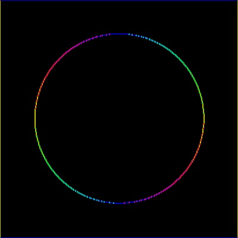

# very WIP imgproc

An application I'm building in Python/Cython with Numpy to process images. VERY rough around the edges but try it out with:

* `$ make`
    * If make fails then change `python3-config` to your relevant version of python
* Open Python
* `import imgproc_cy`
* `imgproc_cy.sobel_operator(img, 70, True)` to try out gradient highlighting with it.

