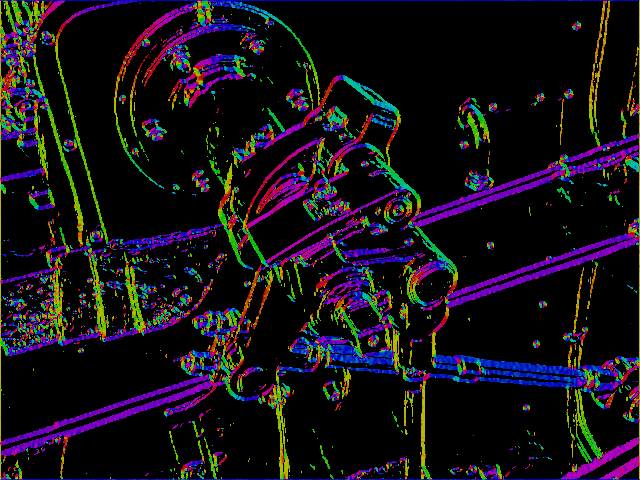

# very WIP imgproc

An application I'm building in Python/Cython with Numpy to process images. VERY rough around the edges but try it out with:

* `$ make`
    * If make fails then change `python3-config` to your relevant version of python
* Open Python
* `import imgproc` and `import cv2`
* `img = cv2.imread('<file>', 0)`
* `out = imgproc.sobel_operator(img, 70, True)`
* `cv2.imwrite('<outfile>', 0)`

Right now the gradient colouring is very susceptible to noise, sorry.